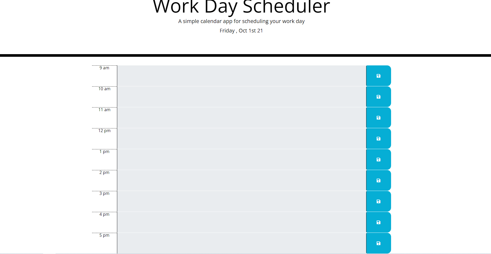
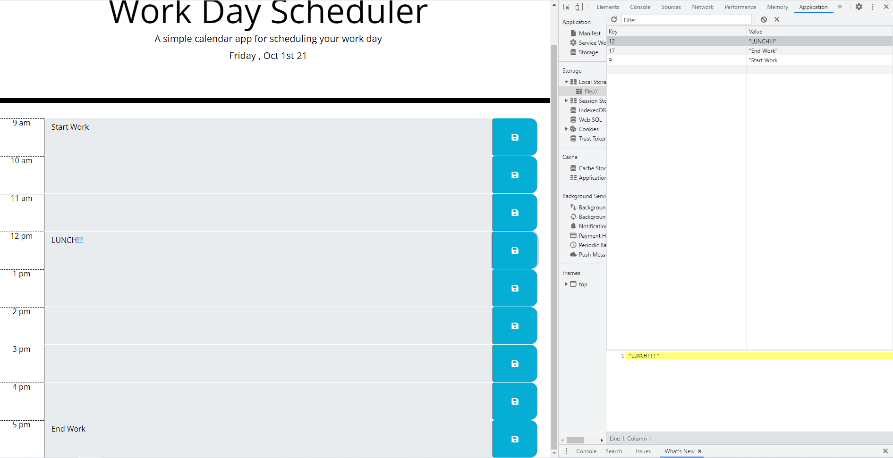

# Work Day Scheduler Starter Code
##Discription:
I was given a html framework and was ask to take that framework and create a work day planner application.
They wanted the colors to change based on if the current time was past, present, or future.
They wanted the ability to enter tasks in each time block by clicking on them, and save that data to localstorage.

##Deployed URL: https://raidernationbuilder.github.io/workday/

##Screenshots:

